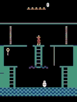
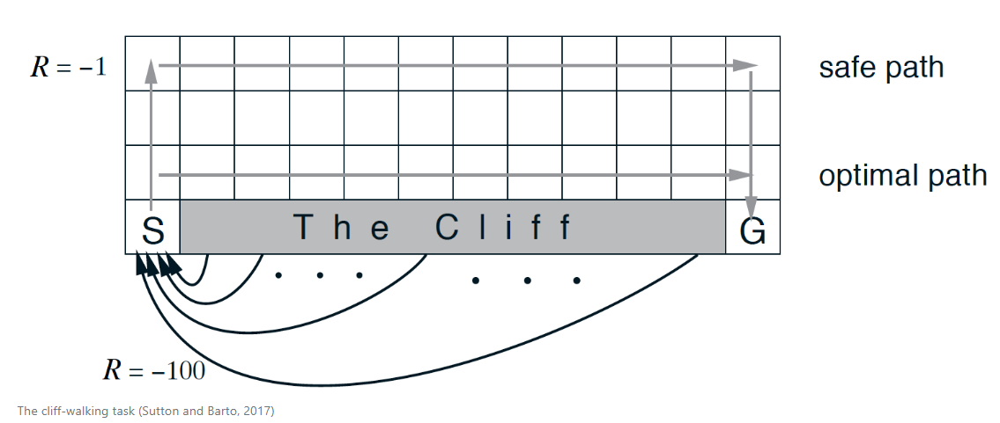

# Practical Deep Reinforcement Learning

This is a practical resource that makes it easier to learn about and apply deep reinforcement learning. For practitioners and researchers, Practical RL provides a set of practical implementations of reinforcement learning algorithms applied on different environments, enabling easy experimentations and comparisons.


**Reinforcement Learning** (RL) is a machine learning approach for teaching agents how to solve tasks by interaction with environments. **Deep Reinforcement Learning** refers to the combination of RL with deep learning.

## Code for RL Algorithms:
- Simple RL algorithms from scratch, based on Numpy, such as Q-Learning, SARSA and REINFORCE applied on simple grid world environments. 
- Advanced RL algorithms using the [Stable Baselines](https://github.com/hill-a/stable-baselines) that extends and improves the [OpenAI Baselines](https://github.com/openai/baselines/).

<a href="https://openai.com" target="_parent"></a>


<a href="https://stable-baselines.readthedocs.io/en/master/" target="_parent"></a>


## 1- Hello Environments! 
<a href="https://colab.research.google.com/drive/1uj_QK86X7qSGtq11ztLkY2yg9GO8GYRx?usp=sharing" target="_parent"></a>

[Gym](https://gym.openai.com/docs/) comes with a diverse suite of environments ranging from Classic control and toy text to Atari, 2D and 3D robots.

```
for t in range(1000):
    action = env.action_space.sample()
    env.render()
    observation, reward, done, info = env.step(action)
    rewards_list.append(reward)
    if done: 
      break;
```

<!--  -->
<!--  -->

[](https://youtu.be/TmPfTpjtdgg)

[](https://youtu.be/W2CAghUiofY)


## 2- Hello RL!
<a href="https://colab.research.google.com/drive/1l3R9QdcVs1Lpy7gq_9zKZejBbdHRi2iV?usp=sharing" target="_parent"></a>

Some RL methods must wait until the end of an episode to update the value function estimate. More practically, **Temporal-difference** (TD) methods update the value function after every time step. Two main algorithms are implemented: 
- 2.1  **SARSA**: Updates Q after SARSA sequence (A is chosen from the e-greedy policy)
```
Q[s,a] = Q[s,a] + alpha * ((r + gama* Q[s1,a1]) - Q[s,a])
```

- 2.2 **Q-Learning**: Updates Q after SARS and use max A (A is chosen from the greedy policy)
```
Q[s,a] = Q[s,a] + alpha*(r + gama*np.max(Q[s1,:]) - Q[s,a])
```



---

# Advanced Deep RL:

## 3- DQN [Human-level control through deep reinforcement learning](https://www.nature.com/articles/nature14236)
<a href="https://colab.research.google.com/drive/1ZVUwrkvj4uZbwV6irejGkW5l2-ZyuBg-?usp=sharing" target="_parent"></a>

A value based RL algorithm, where Deep Neural Network is used as a function approximator to estimate the action value function Q(s, a).


```
total_timesteps = 150000 
env = gym.make('LunarLander-v2')
model = DQN(MlpPolicy, env, verbose=0, prioritized_replay=True, tensorboard_log="./DQN_LunarLander_tensorboard/")
model.learn(total_timesteps=total_timesteps, tb_log_name="DQN_prioreplay")
model.save("dqn_LunarLander_prioreplay")
```


## 4- REINFORCE
<a href="https://colab.research.google.com/drive/1ufRR76yywyDtqddXz_MhcHIrpg5ww_II?usp=sharing" target="_parent"></a>

A policy based RL algorithm that directly gets the optimal policy (direct mapping from states to actions) without estimating a value function. REINFORCE samples few trajectories using the current policy and uses them to estimate the gradient to increase / decrease the action probability based in the return.

## 5- PPO [Proximal Policy Optimization](https://openai.com/blog/openai-baselines-ppo/#ppo)
<a href="https://colab.research.google.com/drive/1xPZI7EeeUf4nVAMEQwL8lrL7sT3lvfog?usp=sharing" target="_parent"></a>

On policy algorithm that uses old trajectories, instead of just throwing them away, by modifying them so that they are representative of the new policy, using approximated re-weight factor. 


```
# multiprocess environment
n_cpu = 4
env = SubprocVecEnv([lambda: gym.make('CartPole-v0') for i in range(n_cpu)])
model = PPO2(MlpPolicy, env, verbose=0, tensorboard_log="./ppo_cartpole_tensorboard/")
model.learn(total_timesteps=total_timesteps, tb_log_name = "PPO2_4")
model.save("ppo_cartpole_4")
```


## 6- A3C and A2C [Asynchronous Methods for Deep Reinforcement Learning](https://arxiv.org/pdf/1602.01783.pdf)
<a href="https://colab.research.google.com/drive/1_M5RhldU-PGak_raI0w1zf9Z6Dp57GYR?usp=sharing" target="_parent"></a>

Actor Critic (AC) methods are a hybrid of value based and policy based methods, where a Critic measures how good the action taken is by estimating a value function, and an Actor controls how the agent behaves (policy-based). 
Asynchronous Methods: multiple agents on different threads are used for parallel exploring the state spaces and make decorrelated updates to the actor and the critic. A3C Asynchronous Advantage Actor Critic where Each agent updates the network on its own, while A2C is the Synchronous variant where it waits for all agents and then update the network at once. 


```
model = A2C(MlpPolicy, env, verbose=0, tensorboard_log="./a2c_cartpole_tensorboard/")
model.learn(total_timesteps=total_timesteps)
```


## 7-  DDPG [Deep Deterministic Policy Gradient](https://arxiv.org/pdf/1509.02971.pdf)
<a href="https://colab.research.google.com/drive/1fb6wt9QKQrSKDwDK7HSXUEqfE9cQ1cUO?usp=sharing" target="_parent"></a>

In DDPG, (DQN) is adapted to continuous action domains, where the Deterministic Policy (the Actor) gives the best believed action for any given state (no argmax over actions)


```
env = gym.make('Pendulum-v0') 
env = DummyVecEnv([lambda: env])
action_noise = OrnsteinUhlenbeckActionNoise(mean=np.zeros(n_actions), sigma=float(0.5) * np.ones(n_actions))
```
```
model = DDPG(MlpPolicy, env, verbose=0, param_noise=param_noise, action_noise=action_noise)
model.learn(total_timesteps=total_timesteps, callback=callback)
```

## 8- TD3 [Twin Delayed Deep Deterministic Policy Gradients](https://arxiv.org/pdf/1802.09477.pdf)
<a href="https://colab.research.google.com/drive/1YJnOw2m0BWqzJFqWwtEm565hE2M1sYl8?usp=sharing" target="_parent"></a>

TD3 is an algorithm that addresses the overestimated Q-values issue of DDPG by introducing the Clipped Double-Q Learning. where TD3 learns two Q-functions instead of one.


```
env = gym.make('BipedalWalker-v2')
env = DummyVecEnv([lambda: env])
n_actions = env.action_space.shape[-1]
action_noise = NormalActionNoise(mean=np.zeros(n_actions), sigma=0.1 * np.ones(n_actions))
```
```
model = TD3(MlpPolicy, env, action_noise=action_noise, verbose=0, tensorboard_log="./td3_BipedalWalker_tensorboard/")
model.learn(total_timesteps=total_timesteps)
```


## 9- Behavior Cloning (BC)
<a href="https://colab.research.google.com/drive/1HWqta3KrI_x_Gr5ugy6B7cfMTrvDPRQC?usp=sharing" target="_parent"></a>

BC uses expert demonstrations (observations-actions pairs), as a supervised learning problem. The policy network is trained to reproduce the expert behavior, then train the RL model for self-improvement.

Steps:
- Generate and save trajectories (ex: using a trained DQN agent)
- Load expert trajectories
- Pretrain the RL model in a supervised way
- Evaluate the pre-trained model  
- Train the RL model for self improvement (RL)
- Evaluate the final RL model 


## 10- GAIL [Generative Adversarial Imitation Learning](https://arxiv.org/pdf/1606.03476.pdf)
<a href="https://colab.research.google.com/drive/1WhiULuo9oBo1kKgXqQjNY53ht3J0TlEG?usp=sharing" target="_parent"></a>

In GANs [Generative Adversarial Networks](https://papers.nips.cc/paper/5423-generative-adversarial-nets.pdf), we have two networks learning together:
- Generator network: try to fool the discriminator by generating real-looking images
- Discriminator network: try to distinguish between real and fake images

GAIL uses a discriminator that tries to separate expert trajectory from trajectories of the learned policy, which has the role of the generator here.

Steps:
- Generate and save expert dataset
- Load the expert dataset
- Train GAIL agent and evaluate


